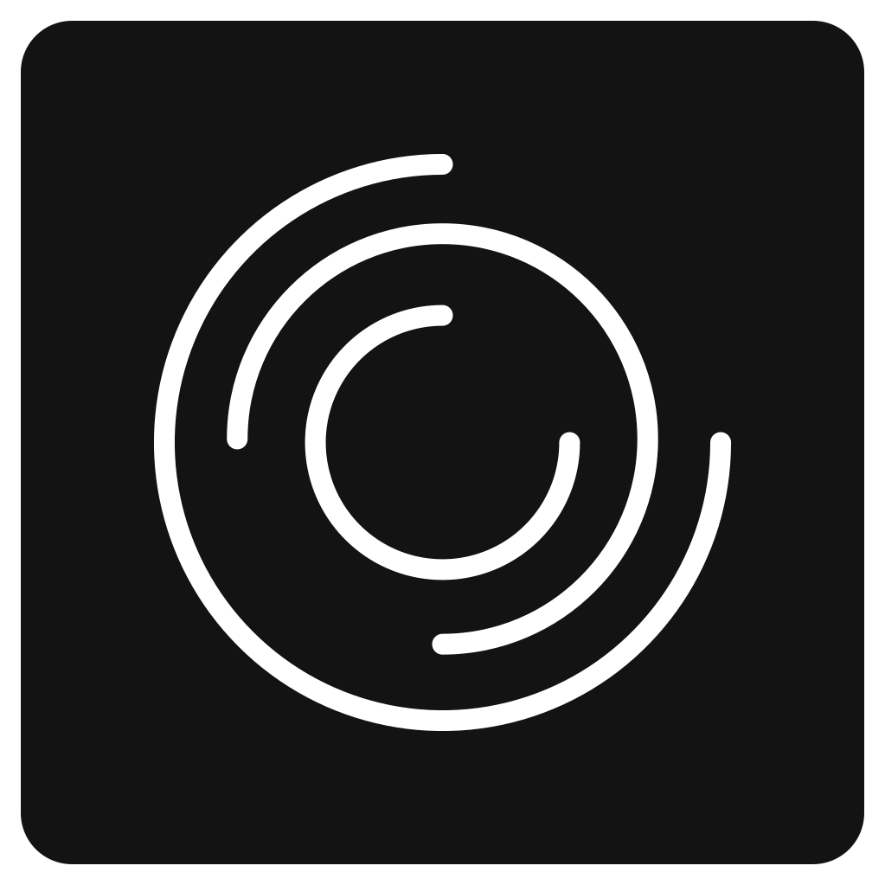
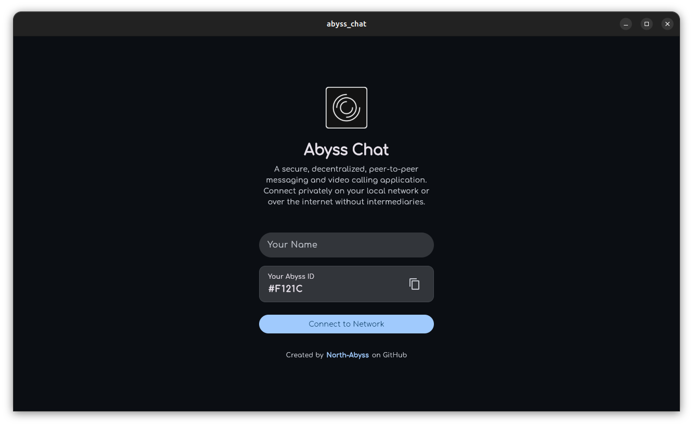
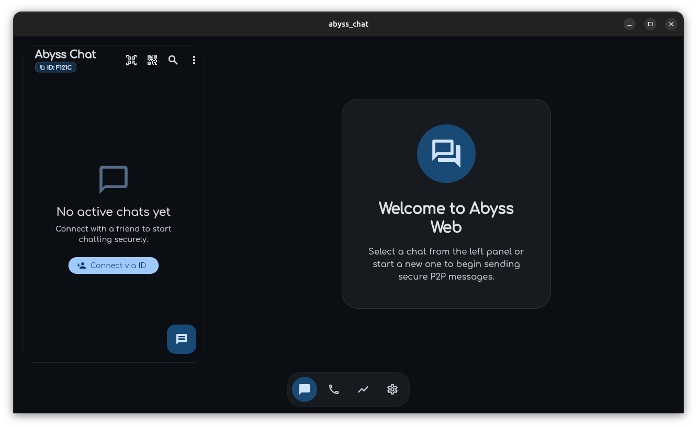
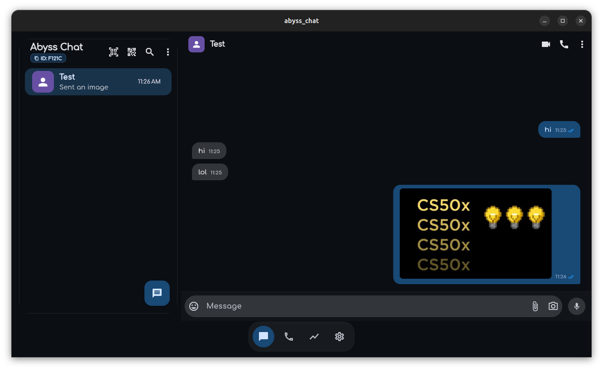
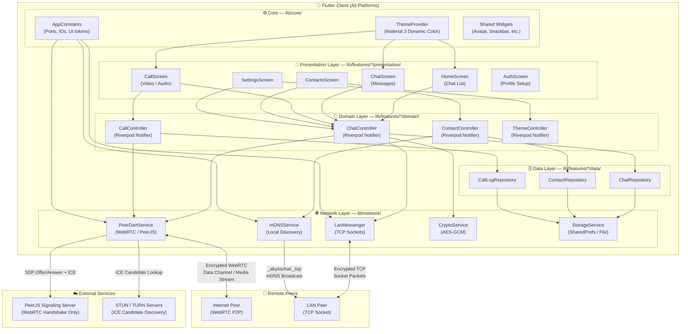
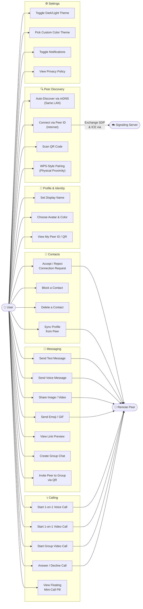
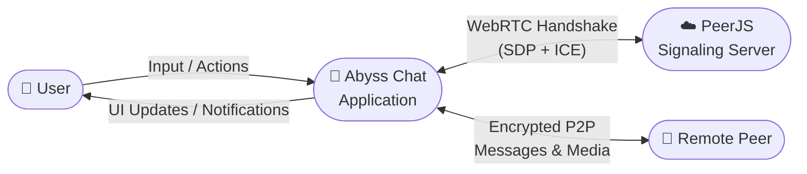
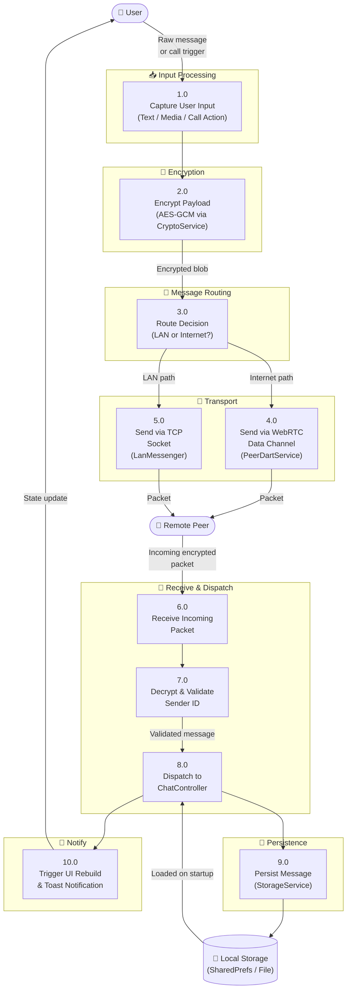
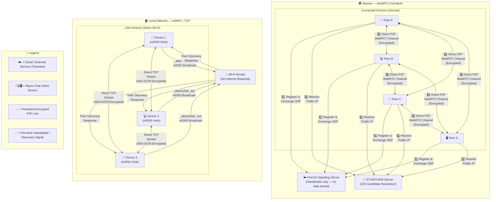

# Abyss Chat

A modern, cross-platform Flutter application serving as a P2P WhatsApp-style clone. It uses WebRTC and local network discovery (mDNS) to connect peers without a central server. Built for all platforms simultaneously.

**Live Web App:** [https://north-abyss.github.io/abyss_chat/](https://north-abyss.github.io/abyss_chat/)  
**GitHub Repository:** [North-Abyss/abyss_chat](https://github.com/North-Abyss/abyss_chat)  
**Download Latest Release (Native Apps):** [Download v1.1.2](https://github.com/North-Abyss/abyss_chat/releases/latest)

    
    
   
  
  
  
  

## 📱 Features

- **P2P Communication** - Uses WebRTC for true peer-to-peer data channels and audio/video calling (supports both 1-on-1 and Group Mesh calls).
- **Offline Sync** - Securely synchronizes missed messages and call logs automatically upon reconnection.
- **Call Logging** - Full integration of voice and video calls into standard chat threads.
- **System Notifications** - Cross-platform notification support (Web APIs, Android/iOS Local Notifications) when the app is in the background.
- **Mutual Contacts Only** - Strict privacy enforcement instantly rejects incoming connections from unknown peers not in your local contacts list.
- **Local Network Discovery** - Uses mDNS (Multicast DNS) and LAN TCP sockets to find and connect to peers on the same local network, working completely offline.
- **Material 3 Design** - Fully customized dynamic theming support with beautiful UI following Material 3 guidelines, including desktop/web responsive split-pane layouts.
- **Persistent Storage** - Saves chats, settings, profiles, and call logs securely (using `path_provider` on native and `shared_preferences` gracefully falling back on Web).
- **Storage Management** - Granular control over your device storage. View visual breakdowns of media vs chat usage, and clear specific chat caches just like WhatsApp.
- **Web Persistent Storage** - Web users get true persistent offline media caching via IndexedDB (`idb_shim`), allowing endless sharing without crashing the browser.
- **Group Chats & Calls** - Create and manage local group chats, and initiate P2P Group Video Calls with dynamic grid layouts.
- **Profile Customization** - Users can customize their names, avatar icons, and colors (including pure black/white).
- **Theming Engine** - Includes 12 curated themes plus the ability to pick any custom hex color.
- **Smart Notifications** - Slide-in floating toasts for incoming messages that automatically silence themselves if you're actively speaking to the sender.
- **Rich Media & Link Previews** - Automatic URL parsing in chats. Web links show rich preview cards, and direct video/image links render inline with playback support.
- **Floating Mini-Call Window** - Picture-in-picture style floating pill when you navigate away from an active call, plus full Answer/Decline call screens.
- **Desktop Keyboard Support** - Use `Enter` to seamlessly send messages and `Shift+Enter` for multiline text, just like WhatsApp Web.
- **End-to-End Encrypted**: All communications are encrypted over WebRTC data channels.
- **Group Calling**: Full Mesh group video/audio calling (up to 10 participants!).
- **Group Customization & QR Join**: Easily customize group names/photos and invite friends instantly by letting them scan your Group QR Code!
- **Cross-Platform**: Runs on Android, iOS, Windows, macOS, Linux, and the Web.
- **Cloud CI/CD Pipeline** - Automated GitHub Actions release builds for Android, Windows, and Linux on every `v*` tag.
- **Cloud Web Deploy Automation** - Web PWA releases are now fully automated and deployed to GitHub Pages via a manual-trigger Cloud Actions workflow (`web-deploy.yml`), eliminating slow local compilations.
- **Maintainable Codebase** - Centralized `AppConstants` hub and deeply documented structural layout for easy onboarding.

## 🏗️ Architecture

Abyss Chat follows a clean architecture pattern with a clear separation of concerns, built for all platforms.

> **📚 Deep Dives:**
> - Check out [EXPLANATION.md](EXPLANATION.md) for a comprehensive Q&A and a visual Mermaid diagram of the architecture (great for interviews!).
> - Check out [agent-memory.md](agent-memory.md) for a full breakdown of the directory structure and project session logs.

### State Management
- **Riverpod** (`flutter_riverpod: ^3.3.2`) - Used for reactive state management.
  - Handles themes, chat states, profiles, active calls, and data synchronization.

### Data & UI Integrations
- **WebRTC** (`flutter_webrtc: ^1.5.2` & `peerdart: ^0.5.6`) - Real-time P2P data channels and media streams.
- **Network Discovery** (`nsd: ^5.0.1`) - Multicast DNS for finding local peers offline.
- **SharedPreferences** (`shared_preferences: ^2.5.5`) - Local device storage for chats and metadata.
- **UUID** (`uuid: ^4.5.3`) - Generates unique identifiers.
- **Animations** (`flutter_animate: ^4.5.2`) - Beautiful UI transitions and micro-animations.
- **Emoji Picker** (`emoji_picker_flutter: ^4.4.0`) - Floating emoji overlay for chat messages.
- **Local Notifications** (`flutter_local_notifications: ^22.0.1`) - Native background and local notifications.

### Key Components

The app follows a **Feature-First Architecture** divided into:

- **`lib/core/`**: App-wide constants, theming, and shared widgets.
- **`lib/features/`**: The main business logic grouped by domain (e.g., `chat`, `calling`, `contacts`, `auth`). Each feature contains its own `data`, `domain`, and `presentation` layers.
- **`lib/network/`**: Cross-cutting infrastructure services including WebRTC handshakes, mDNS discovery, and encrypted local storage.
- **`lib/app/`**: High-level app initialization and responsive layout wrappers.

## 🚀 Getting Started

To run this project locally, ensure you have Flutter installed.

1. Clone the repository.
2. Run `flutter pub get` to install dependencies.
3. Use `flutter run` to launch on your connected device or emulator.
4. For Linux specifically, ensure the necessary dependencies for `flutter_webrtc` are present on your system.

## 📖 Usage Guide

Abyss Chat is a 100% decentralized P2P application. This means there are no servers storing your messages or routing your data!

1. **Setting up your Profile:** When you first launch the app, enter a display name and choose a unique Avatar color/icon.
2. **Connecting to Peers Locally:** If you and your friends are on the same Wi-Fi network, the app will automatically discover them (using mDNS). They will appear instantly on your screen!
3. **Connecting Globally (Internet):** If you are not on the same Wi-Fi, you can still connect anywhere in the world! Simply tap **"Connect via ID"** and enter your friend's 6-digit Peer ID (found on their profile or QR Code). Both of you must have the app open and connected to the internet.
4. **Group Chats:** You can create Group Chats and invite your peers. Note: Group chats and calls are Full Mesh P2P, meaning your device connects directly to every other person. Large groups (10+ people) require strong internet connections and devices.
5. **WPS Pairing:** If you are physically next to someone, you can use the WPS (Wi-Fi Protected Setup) style button to instantly pair without typing IDs.

## ⚖️ Legal & Privacy

- **Privacy Policy:** Abyss Chat is heavily focused on privacy. We collect zero data. Read the full [Privacy Policy](PRIVACY.md).
- **License:** This project is open-source and licensed under the [MIT License](LICENSE).

---

## 📐 Architecture Diagrams

### 5.1 System Architecture (Flutter & WebRTC Overview)

A holistic view of all layers in the Abyss Chat application — from the Flutter UI down to the peer-to-peer network layer.

---

### 5.2 Use Case Diagrams

**Primary Actors:** `User` (local device) · `Remote Peer` (another Abyss Chat user) · `Signaling Server` (PeerJS, used only for WebRTC handshake)

---

### 5.3 Data Flow Diagrams (DFD)

#### Level 0 — Context Diagram

#### Level 1 — Internal Data Flow

---

### 5.4 Network Topology Diagram

Abyss Chat supports two distinct network topologies that can run simultaneously.

> **Key insight:** The signaling server and STUN/TURN servers are only used during the initial WebRTC handshake (seconds). Once peers are connected, **all data flows directly between devices** with no server involvement. On a local network, the app works **100% offline** with zero cloud dependency.
