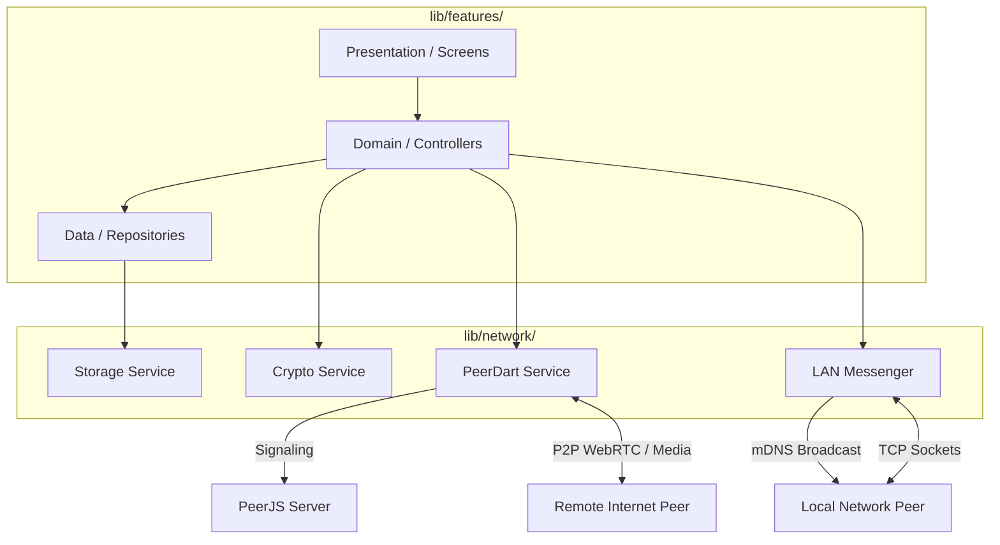

# Abyss Chat - Architecture & Interview Guide

This document is designed to provide a comprehensive explanation of Abyss Chat's inner workings. It is structured as a Q&A to help developers, interviewers, or contributors understand the technical decisions, architecture, and flow of the application.

## 🏗️ High-Level Architecture Diagram

---

## FAQ - Q&A

### Q: What is Abyss Chat and what problem does it solve?
**A:** Abyss Chat is a cross-platform, decentralized peer-to-peer (P2P) messaging and video calling application. Traditional messaging apps rely on central servers to route and store messages, which introduces privacy concerns and single points of failure. Abyss Chat solves this by connecting devices directly to one another using WebRTC over the internet, or mDNS/TCP sockets over a local offline network. There is no central database storing your chats.

### Q: Can you explain the state management approach you took?
**A:** We use **Riverpod** for reactive state management. The architecture is cleanly divided:
1. **Services** (Infrastructure) handle heavy I/O like WebRTC signaling, TCP sockets, and local storage. They are completely stateless and UI-agnostic.
2. **Providers** (State) wrap these services. They hold the active state (like the current list of chat threads or active call status) and listen to streams from the services.
3. **Screens** (UI) simply watch the Providers. When a new message arrives over a socket, the `chat_provider` updates its state, and the UI automatically rebuilds only where necessary.
4. **Constants** (Config) are centralized in `app_constants.dart` to serve as a single source of truth for global magic numbers (e.g., LAN ports, mDNS identifiers, timeouts, and UI dimensions).

### Q: How does the Peer-to-Peer (P2P) communication actually work under the hood?
**A:** For internet communication, we use **WebRTC** via the `flutter_webrtc` and `peerdart` packages. 
- When a user wants to connect, the app briefly talks to a lightweight signaling server (a standard PeerJS server) just to exchange connection coordinates (SDP offers and ICE candidates).
- Once the handshake is complete, a direct WebRTC Data Channel is opened for text messaging, and Media Streams are opened for audio/video calling.
- The data flows directly between the two devices. If the signaling server goes down after the connection is made, the chat/call will continue uninterrupted.

### Q: How do you handle local network discovery without an internet connection?
**A:** If users are on the same Wi-Fi network but have no internet access, cloud WebRTC signaling won't work. To solve this, we implemented the `lan_messenger` which runs a native **TCP/WebSocket Server** on the Android/Desktop host. 
The app broadcasts an mDNS (Multicast DNS) service on the local network (`_abysschat._tcp`). For Web clients (which cannot read mDNS), the local IP and Port are embedded in the user's QR code. When a Web client scans the QR, it opens a direct WebSocket connection to the Android host, bypassing the cloud to perform an instantaneous, 100% offline WebRTC handshake!

### Q: How is data privacy and security enforced?
**A:** Security is handled in two primary ways:
1. **End-to-End Encryption:** Before any message is sent over WebRTC or TCP, it is encrypted using AES-GCM in the `crypto_service.dart`. 
2. **Strict Mutual Contacts:** The network layers enforce a strict privacy policy. When an incoming connection attempt is detected, the app checks if the sender's Peer ID exists in the user's local contacts. If it does not, the socket is immediately destroyed and the connection is rejected silently.

### Q: How do you handle Group Chats and Group Calls without a central server? Are there limits?
**A:** Since we don't have a central server to distribute messages or mix video streams (like an SFU or MCU), we rely on a **Full Mesh Topology**:
- **Group Chats**: When a user sends a message to a group, the app iterates through every participant in that group and sends the encrypted message individually to each member over their respective P2P data channels.
- **Group Calls (Voice/Video)**: The app establishes a direct WebRTC media connection with *every* other participant in the group simultaneously. 
- **The Limits:** Because a Full Mesh network requires your device to encode and upload your video stream separately to every participant (and decode everyone else's streams), bandwidth and CPU usage scale exponentially. We issue a performance warning for group calls exceeding **10 members**, as typical mobile devices and home networks will struggle to handle more than 10 simultaneous HD video streams. Text-based group chats can support significantly more members since text payloads are minuscule.

### Q: What challenges did you face with Web and Desktop support, and how did you resolve them?
**A:** Building for mobile, web, and desktop simultaneously presented a few hurdles:
- **Storage limitations:** The `path_provider` package doesn't work on the Web for file system access. We abstracted the `storage_service.dart` to gracefully fall back to `SharedPreferences` when compiled for Web, while using encrypted file streams on Native platforms.
- **Responsive UI:** We used a `responsive_layout.dart` wrapper. On mobile, it uses standard Stack navigation. On large screens (Desktop/Web), it seamlessly switches to a split-pane layout (contacts on the left, chat on the right) without duplicating state or causing Hero animation errors.
- **Android Plugin Interop:** Older Flutter environments forcibly generate Java plugin registrants that crash when trying to compile modern Kotlin-based plugins like `file_picker`. To maintain full native registration without resorting to cache-breaking commands on NTFS drives, we inject a `doFirst` task during Gradle's `JavaCompile` phase that dynamically patches `GeneratedPluginRegistrant.java` using **Java Reflection** to safely instantiate Kotlin plugins.
- **Local Network Testing (WebRTC NAT Hairpinning):** When testing the Web App and Native App on the **exact same Wi-Fi network**, modern browsers (like Firefox and Chrome) obfuscate their local IPs using `.local` mDNS addresses for privacy. Because most home routers block NAT Hairpinning (loopback), WebRTC ICE connections will fail. This is avoided when testing Localhost (Linux to Web on the same machine) because `127.0.0.1` is not obfuscated. To bypass this during mobile/web local testing, users must either use Cellular Data or manually disable `media.peerconnection.ice.obfuscate_host_addresses` in Firefox `about:config`.
- **Web Deployment:** To avoid slow local web compilations that lock up developer machines, we implemented a Cloud CI/CD pipeline using GitHub Actions (`web-deploy.yml`) that automatically compiles the Web PWA and deploys it to GitHub Pages whenever a `web-deploy-*` tag is pushed.
- **Video Sizing:** We originally used rigid `GridView` layouts for group calls, which clipped video on widescreen monitors. We refactored this into a dynamic Flex/Wrap layout using `RTCVideoViewObjectFitContain` to ensure aspect ratios are respected perfectly across all form factors.
