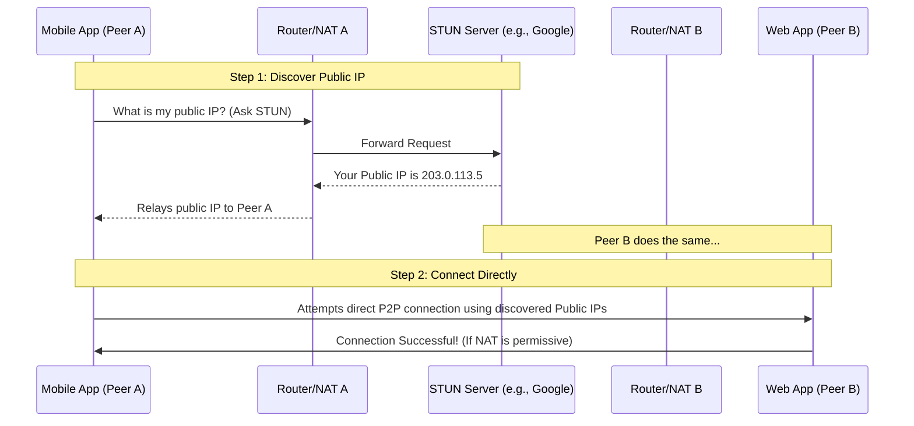
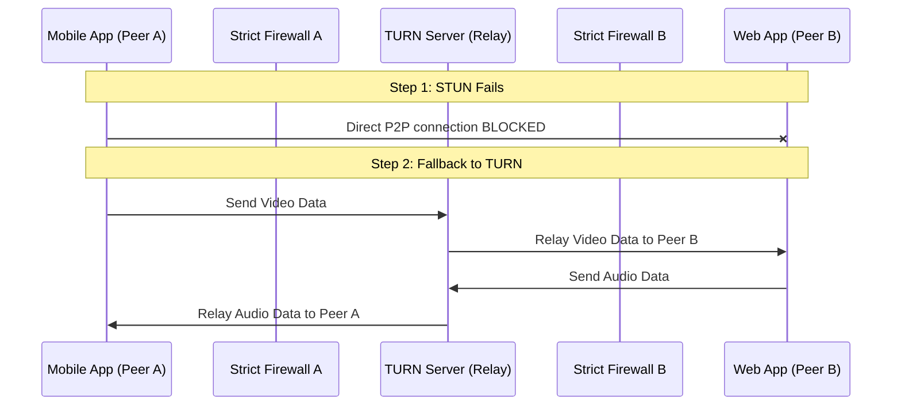

# Understanding STUN and TURN in WebRTC

WebRTC relies on a framework called **ICE (Interactive Connectivity Establishment)** to connect two peers. Because most devices are hidden behind routers and NATs (Network Address Translation), they don't know their own public IP address. This is where STUN and TURN come in.

---

## 1. STUN (Session Traversal Utilities for NAT)

A **STUN** server is like a mirror. 
When your device asks a STUN server, *"What do I look like to the outside world?"*, the STUN server simply replies with your router's public IP address and port.

Once both peers know their public IP addresses, they share them via the signaling server and attempt a direct P2P connection.

### How STUN Works (Mermaid Diagram)

> [!TIP]
> STUN servers are extremely lightweight and free (like Google's STUN). They only handle the initial "handshake" and do not process video/audio data. **90% of WebRTC connections succeed using only STUN.**

---

## 2. TURN (Traversal Using Relays around NAT)

Sometimes, routers are very strict (Symmetric NAT) or corporate firewalls block direct P2P connections. If a direct STUN connection fails, WebRTC falls back to a **TURN** server.

A TURN server acts as an active **Relay**. If Peer A cannot connect to Peer B directly, both peers connect to the TURN server, and the TURN server passes the heavy audio/video/file data between them.

### How TURN Works (Mermaid Diagram)

> [!WARNING]
> Because TURN servers must actively relay high-bandwidth data (like a 1GB file transfer or a live video call), they consume massive amounts of bandwidth and CPU. This is why reliable TURN servers are **never free** and why the free `metered.ca` TURN server we used crashed.

---

## Can the Web App act as a STUN/TURN Server?

**Short Answer:** No.

**Detailed Explanation:**
1. **No Public IP:** To be a STUN or TURN server, the server must sit on the open internet with a dedicated, static Public IP address that isn't behind a router. A web browser running on a laptop or phone is almost always behind a home router.
2. **No Raw Sockets:** Browsers do not have the security permissions to open raw UDP listening ports. A true TURN server (like `coturn`) requires direct OS-level network control.
3. **Application Level vs Network Level:** While you *could* theoretically build a mesh network where Peer A sends data to Peer B, and Peer B forwards it to Peer C (acting as an application-level relay), Peer B still cannot act as a foundational ICE STUN/TURN server that helps Peer A establish its very first connection.

### How do we fix our app then?
We should simply rely on reliable STUN servers (like Google's) to achieve an 80-90% success rate for direct P2P connections. If you absolutely need 100% connection reliability across strict corporate firewalls, you would eventually need to rent a $5/month VPS (Virtual Private Server) to host your own dedicated `coturn` server. For now, removing the broken TURN server and keeping STUN will get the app working again!
