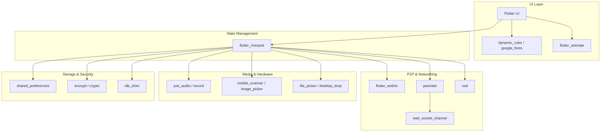

# Abyss Chat Dependencies

This document provides an overview of the key dependencies used in Abyss Chat, what they are, and why they are used to power the application.

## 🏗️ Architecture Dependency Graph

Below is a Mermaid graph illustrating how the core dependencies interact within the app's architecture:

## 📦 Core & State Management
- **`flutter_riverpod`**: A reactive caching and data-binding framework.
  - *Why used*: Manages the application state safely and efficiently, handling things like active chats, WebRTC connection states, and user preferences.

## 🚀 CI/CD Infrastructure
- **GitHub Actions (`web-deploy.yml`, `release.yml`)**: Cloud compilation workflows.
  - *Why used*: Automatically builds Native apps (APK, Linux, Windows) and publishes the Web app to GitHub Pages. Ensure `compileSdkVersion 36` is used to prevent Gradle evaluation errors.

## 🌐 Networking & P2P (The Core of Abyss Chat)
- **`peerdart`**: A Dart port of PeerJS.
  - *Why used*: Handles the signaling process to establish direct Peer-to-Peer (P2P) connections between users.
- **`flutter_webrtc`**: WebRTC plugin for Flutter.
  - *Why used*: Powers the actual real-time P2P data channels (for text and files) and media streams (for audio/video calls) after `peerdart` establishes the connection.
- **`nsd`**: Network Service Discovery.
  - *Why used*: Allows the app to discover other Abyss Chat users automatically on the same local network (LAN) without needing an internet connection.
- **`web_socket_channel` & `http`**: Standard networking protocols.
  - *Why used*: Used for communicating with the signaling server to negotiate connections before upgrading to WebRTC.

## 🎨 UI & UX Enhancements
- **`dynamic_color`**: Extracts colors from the user's wallpaper (Material You).
  - *Why used*: Provides a highly personalized and native-feeling theme on Android.
- **`flutter_animate`**: A highly declarative animation library.
  - *Why used*: Adds buttery-smooth micro-animations to UI elements for a premium feel.
- **`emoji_picker_flutter`**: An emoji keyboard.
  - *Why used*: Essential for modern chat applications to allow expressive communication.
- **`google_fonts`**: Provides access to Google's typography library.
  - *Why used*: Enhances the visual appeal of the app with modern typefaces.

## 📸 Media, Files & Hardware
- **`just_audio` & `record`**: Advanced audio playback and recording.
  - *Why used*: Enables sending and receiving voice notes, and playing ringtones during calls.
- **`image_picker` & `file_picker`**: Access to the device's file system and camera roll.
  - *Why used*: Allows users to share photos, videos, and documents securely over P2P.
- **`desktop_drop` & `super_clipboard`**: Desktop-specific interactions.
  - *Why used*: Enables drag-and-drop file sharing and rich clipboard support for Windows/Linux/macOS desktop builds.
- **`mobile_scanner` & `qr_flutter`**: QR code scanning and generation.
  - *Why used*: Allows users to easily add contacts or join networks by scanning a QR code instead of typing IDs.

## 🔒 Security & Local Storage
- **`encrypt` & `crypto`**: Cryptographic algorithms. 
  - *Why used*: Provides End-to-End Encryption (E2EE) ensuring that even if traffic is intercepted, messages cannot be read. 
- **`shared_preferences` & `idb_shim`**: Persistent local storage.
  - *Why used*: Stores user settings, themes, and chat history locally on the device (or in IndexedDB on the Web) without relying on a central database. 

## 🛠️ Utilities
- **`uuid`**: Generates unique identifiers (used for generating peer IDs and message IDs).
- **`flutter_local_notifications`**: Pushes background notifications for incoming messages or calls.
- **`any_link_preview`**: Extracts metadata from URLs shared in chat to show rich link previews.
- **`window_manager`**: Allows manipulation of the app window (resizing, maximizing) for desktop builds.

