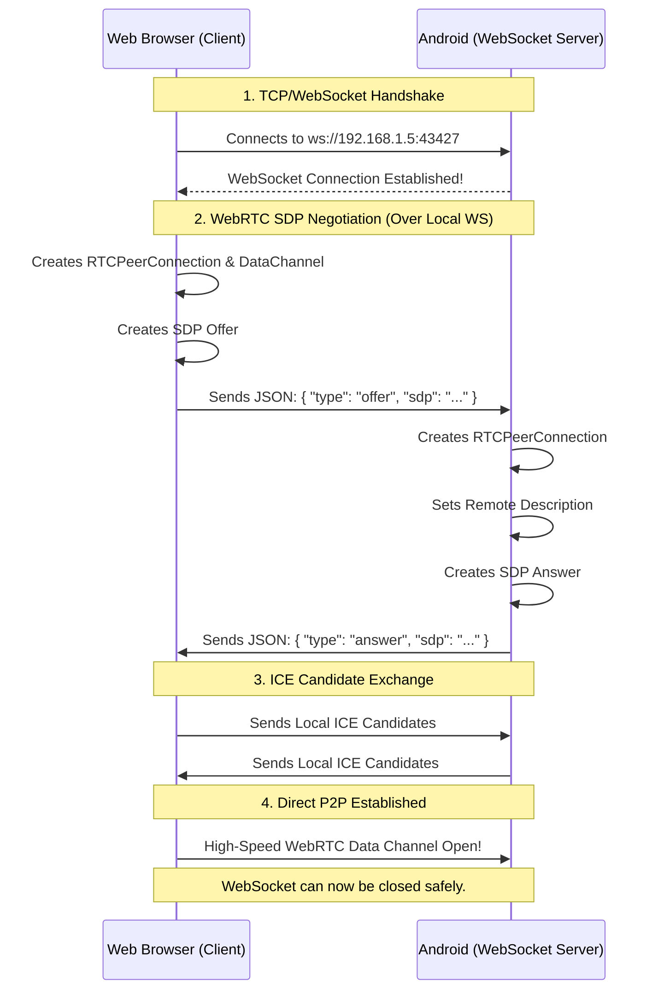

# The Impossible Dream: 100% Offline WebRTC

Here is exactly how we are going to build a completely offline, ultra-stable WebRTC pipeline that connects a Flutter Web Browser to a Native Android device without a single cloud server.

## The Problem with Cloud Signaling
Normally, WebRTC requires a middleman (Signaling Server) to introduce two peers. `peerdart` uses PeerJS, which hosts its signaling server in the cloud. 
- If your internet drops, local WebRTC fails.
- If you hot-restart, the cloud server holds onto your old socket (Zombie state) and rejects your new connection ("ID is taken").
- If your router is strict, the cloud STUN server fails to negotiate a path back into your local network.

## The Solution: Native Local Signaling

We are going to make the Android device act as its own Signaling Server.

### How it Works Step-by-Step
1. **The Native Server:** The Android app runs a background `HttpServer` bound to `0.0.0.0` (all interfaces) on port `43427`. It upgrades incoming HTTP requests into raw WebSockets.
2. **Discovery:** The Android app embeds its Local IP and Port into its QR Code. 
3. **The Web Client:** The Web Browser scans (or the user types) the IP. The browser instantly opens a `WebSocket` connection to the Android device over the LAN. 
4. **The Handshake:** Because they are directly connected via WebSockets, they instantly exchange their WebRTC cryptographic keys and SDP profiles. No cloud server involved.
5. **The WebRTC Upgrade:** Once WebRTC connects, the app switches to the high-performance WebRTC DataChannel for text, files, and video calling.

This completely bypasses PeerJS, eliminates Zombie ID issues, and guarantees a 0-latency connection as long as both devices are on the same Wi-Fi.
